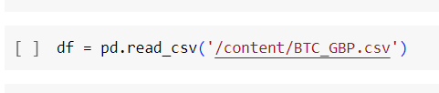

# Cryptocoin Future Price Predicition  
In this project, I am predicting future prices of the speicified bitcoin on the basis of **MAX** historical data. MAX refers to data which was taken since the cryptocoin came in the market. Basically, I've taken into consideration only few cryptocurrency which are mentioned in the  **Historical Data\sym.csv** file. By leveraging the power of RNN, this is build from **Tensorflow framework** and using **Keras API**. With the minimum loss, we can train the RNN based on given data.   

## Data Preparatione  
The yahoofinance API has been very useful for me to get real-time data of any cryptocoin.
1. Install yahoo finance API using **"pip install yfinance
"** .
2. Open **sym.csv** file which is located in **Historical Data** folder. There you'll see symbol column in which you've to add symbols of crptocoins for which you want to get the real-time data.
3. Now run **Data_Preparation.py** file, which will fetch the symbol of cryptocoin one by one from the csv file(refer to step 2 for csv file) . After some time, you will see csv files of the cryptocoins with real-time data in it.
4. Now, we have all the data for training and testing.

## Training & Testing

Now I've done my training on Google Colab which provides GPU which is enough to train model on this type of data. In order to train model, follow below mentioned steps:-
1. Upload the **Inferencing & Training Script\Bitcoin_Price_Prediction.ipynb** on Google Colab and select GPU as runtime.
2. From the **Historical Data** upload any one csv file of cryptocoin data to google colab and keep the path of that file in the training data path cell.  